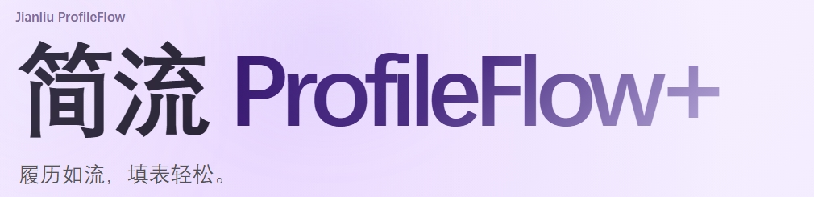
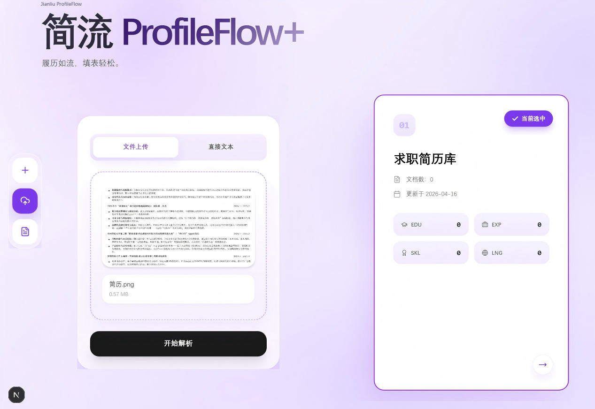
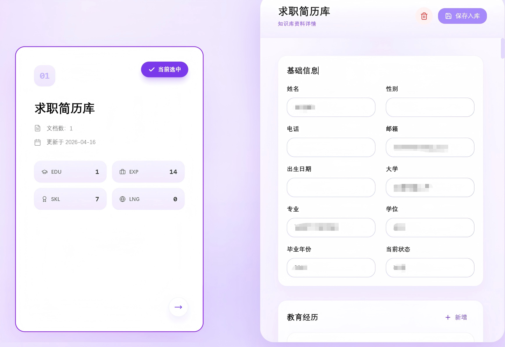
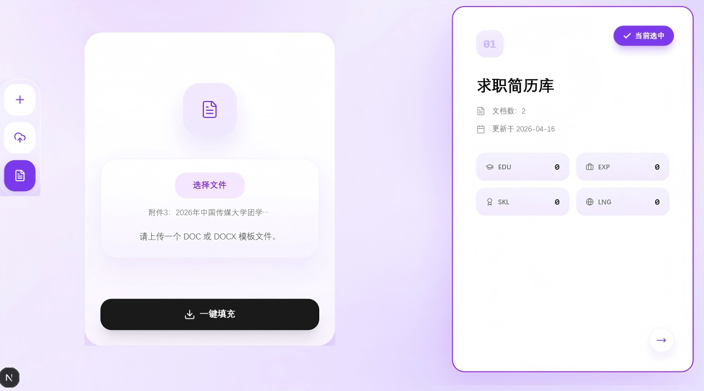
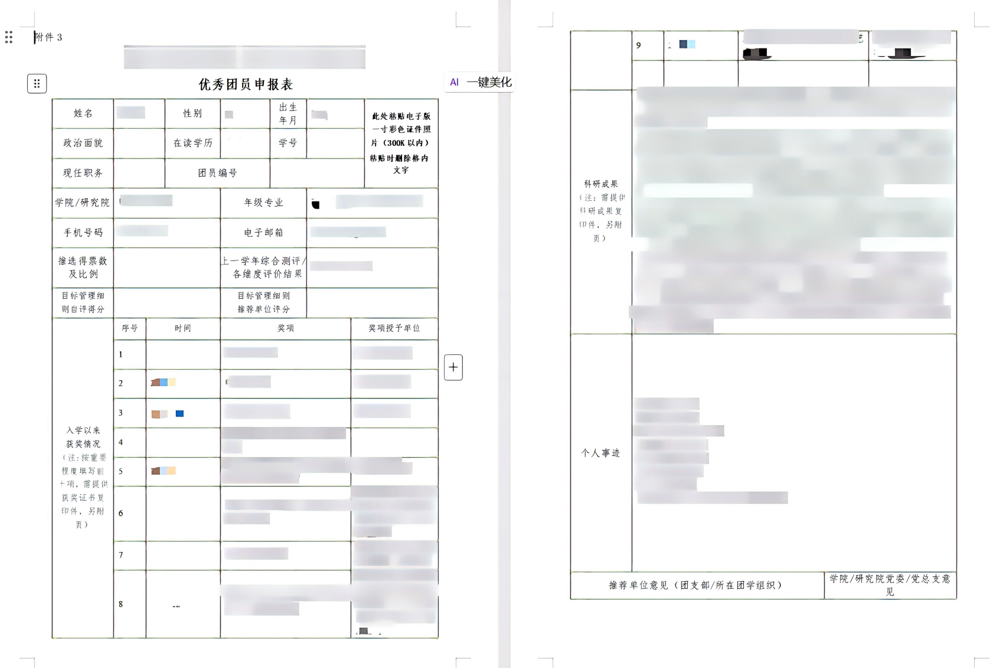

# ProfileFlow



[中文说明 / Chinese Guide](./README_CN.md)

ProfileFlow is an intelligent personal-profile management and autofill tool designed for students and job seekers. It supports transcripts, certificates, resumes, internship proofs, research outputs, and other application materials. With OCR, document parsing, and structured extraction, it turns scattered files into a reusable personal knowledge base.

Once the knowledge base is built, ProfileFlow can match the most relevant personal information to document templates and repetitive application workflows, helping users complete job applications, graduate-school applications, competition registrations, and similar tasks more efficiently.

Note: the current extraction prompts and built-in categories are optimized for Chinese-language materials.

## Features

- Parse images, PDFs, DOCX, TXT files, or pasted raw text
- Extract structured profile data with OCR + LLM-based parsing
- Review and edit parsed data before saving
- Store and reuse multiple local knowledge bases
- Autofill Word templates with saved profile information
- Keep a manual review step before final submission

## Recent Fix

- Fixed image-upload extraction returning blank results in environments using newer PaddleOCR output formats
- Added compatibility handling for both legacy and newer OCR response structures

## Tech Stack

- Frontend: Next.js 15, React 19, TypeScript, Tailwind CSS
- Backend: FastAPI, Python
- OCR and parsing: PaddleOCR, PyMuPDF, python-docx, Ark runtime SDK
- Storage: SQLite

## Project Structure

```text
app/                Next.js App Router pages
components/         Reusable UI components
lib/                Frontend utility helpers
public/             Static assets
docs/images/        README screenshots and images
main.py             FastAPI backend entry
requirements-backend.txt
package.json
```

## Prerequisites

- Node.js 18+
- Python 3.10+
- Git

## Environment Variables

Create a `.env` file in the project root:

```env
ARK_API_KEY=your_api_key
ARK_BASE_URL=https://ark.cn-beijing.volces.com/api/v3
ARK_TEXT_ENDPOINT_ID=your_text_model_endpoint
ARK_VISION_ENDPOINT_ID=your_vision_model_endpoint
ARK_TIMEOUT=180
ARK_MAX_TOKENS=4000
OCR_LANG=ch
PDF_TEXT_THRESHOLD=80
MAX_TEXT_CHARS=12000
```

## Install

Install frontend dependencies:

```bash
npm install
```

Install backend dependencies:

```bash
pip install -r requirements-backend.txt
```

## Run Locally

Start the backend:

```bash
uvicorn main:app --reload --host 127.0.0.1 --port 8000
```

Start the frontend in another terminal:

```bash
npm run dev
```

Open [http://localhost:3000](http://localhost:3000).

## API Endpoints

- `POST /api/extract`
- `POST /api/knowledge/save`
- `GET /api/knowledge-bases`
- `POST /api/knowledge-bases`
- `PUT /api/knowledge-bases/{knowledge_base_id}`
- `DELETE /api/knowledge-bases/{knowledge_base_id}`
- `POST /api/templates/fill`
- `GET /health`

## Quick User Flow

1. Create a knowledge base for a specific scenario, such as job applications or graduate-school applications.
2. Upload materials or paste text into the parser.
3. Review and correct extracted profile fields.
4. Save the cleaned result into the selected knowledge base.
5. Upload a Word template and let ProfileFlow autofill it.
6. Review the exported document before submission.

For the full Chinese tutorial, see [README_CN.md](./README_CN.md).

## Screenshot Guide

### 1. Initial Page

When no knowledge base has been created yet, the system starts from an empty state.


### 2. Upload and Parse Materials

Select a target knowledge base, then upload files or paste text for extraction.



### 3. Review and Edit Extraction Results

After parsing, review the extracted profile fields and manually correct any missing or inaccurate items before saving.



### 4. Enter Autofill Workflow

Choose the saved knowledge base and open the autofill entry.



### 5. Download the Generated File

After uploading a Word template, the generated file will be downloaded automatically.


### 6. Final Filled Result

Review the exported document one more time before submitting it externally.



## Notes

- The local SQLite database is ignored in Git by default.
- Build output and cache folders are ignored to keep the repository clean.
- Some OCR and model features depend on external service credentials being configured correctly.
